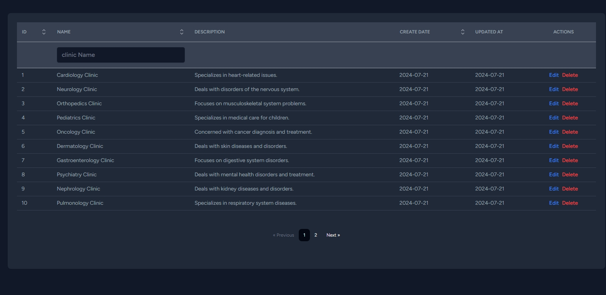
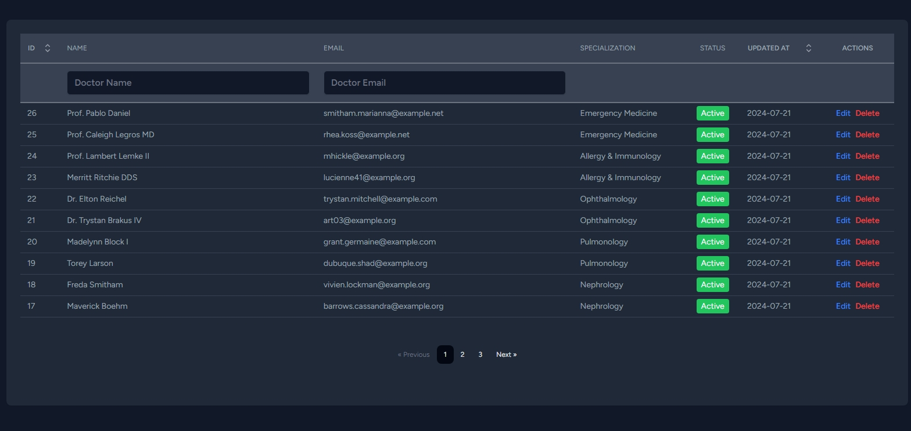
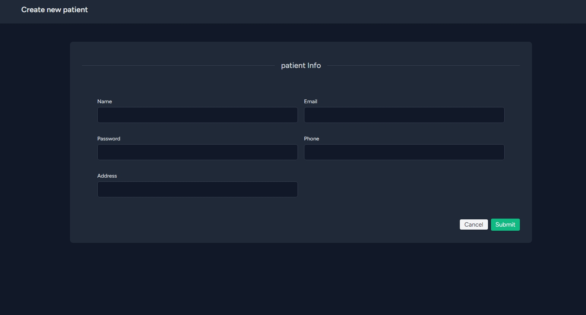
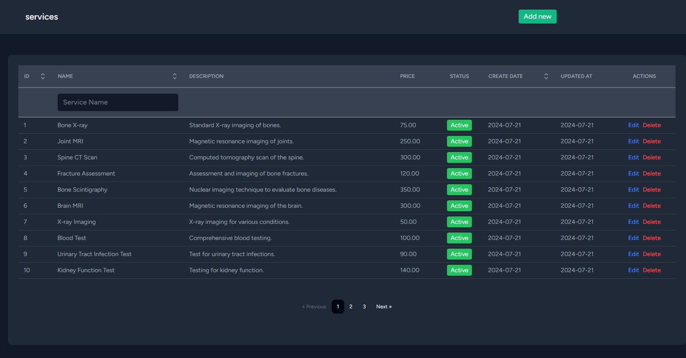
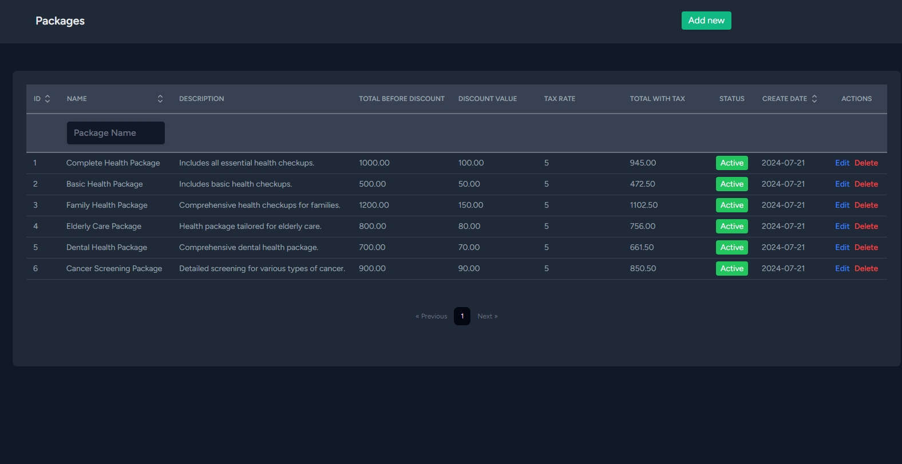
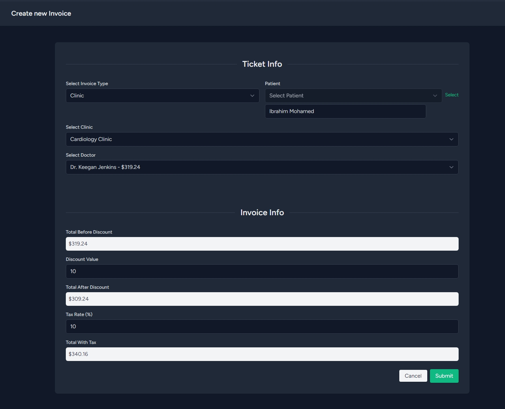

# Hospital Management System

## Overview
This project aims to provide a comprehensive solution for managing various aspects of a hospital, including clinic management, doctor profiles, patient records, medical services, service packages, and **invoicing**.

## Technologies Used
- **Backend**: Laravel 11
- **Frontend**: React with Inertia.js
- **Database**: MySQL

## Features

### Clinics
- **API CRUD operations** for managing clinic profiles.
- Clinics specialize in various fields such as Cardiology, Neurology, Orthopedics, etc.

### Doctors
- **API CRUD operations** for managing doctor profiles.
- Assign doctors to clinics and specializations.
- Manage doctor appointments and schedules.

### Patients
- **API CRUD operations** for managing patient profiles.
- Upload patient information, including contact details.

### Services
- **API CRUD operations** for managing medical services.
- Services include various tests, checkups, and treatments offered by the hospital.

### Packages
- **API CRUD operations** for managing service packages.
- Packages bundle multiple services together at a discounted rate.

### Invoices
- **API CRUD operations** for ***Fast*** managing invoices.
- Generate invoices for patients based on selected services, packages, and doctors.
- Calculate totals with discount and tax rates.

